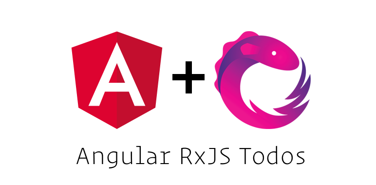

  

# Angular RxJS Todos

This repo shows a basic todos example base on the famous [TodoMVC](https://github.com/tastejs/todomvc) but using RxJS and Angular. The goal is to show how to use the Observables data architecture pattern within Angular 2.
